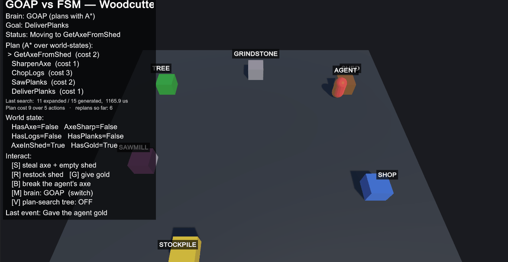
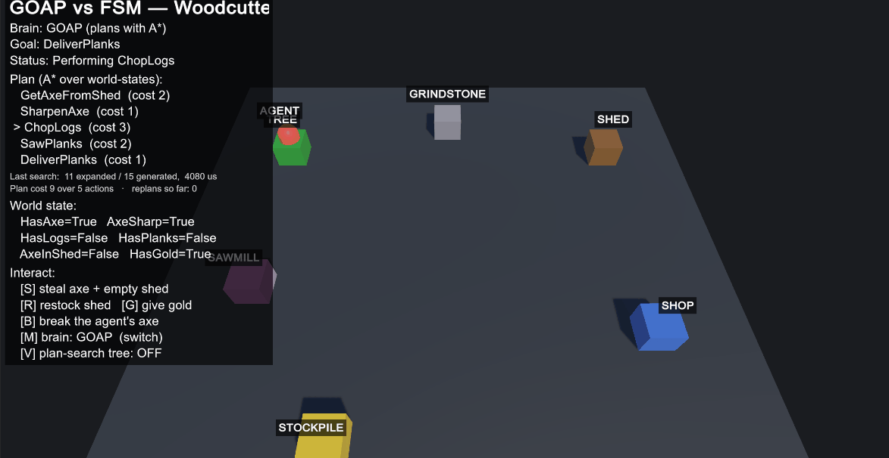
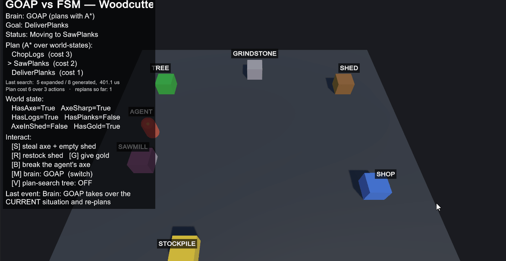

# Goal-Oriented Action Planning (GOAP) — Game AI Research

**Author:** Stefan Filipovski
**Engine:** Unity 6 (6000.3, Built-in Render Pipeline), C#

> **Note on this repository.** The retake assignment points at the same GitHub Classroom
> repository as the first take, so this branch (`main`) holds the **retake** research project on
> GOAP. The original first-take project on Flow Fields is untouched and preserved on the
> [`first-take-flowfields`](../../tree/first-take-flowfields) branch.

> A small, self-contained Unity demo of an agent that *plans* its own behaviour with A\*
> instead of following a hand-authored script. A woodcutter is given a goal — "deliver wood"
> — and works out the cheapest sequence of actions to achieve it, re-planning on the fly when
> the world changes underneath it.
>
> The demo also ships **a live A\* search visualizer** (press **V**) and **a hand-authored FSM
> running the same job** (press **M**), so you can watch the planning happen and see exactly
> where the traditional approach breaks down.

---

## Why GOAP?

Most game agents make decisions with a **Finite State Machine (FSM)** or a **Behaviour Tree
(BT)**. Both work by *hand-authoring the transitions*: the designer explicitly wires "if in
state A and condition X, go to state B". This is fast and predictable, but it has a well-known
scaling problem — every time you add an action or a condition, the number of transitions you
have to author and maintain grows combinatorially. A FSM with 10 states can need up to 90
transitions. Add an eleventh state and you may touch dozens of existing ones.

**GOAP inverts the problem.** Instead of authoring *how* the agent reaches its goals, you only
describe:

- **the actions** the agent *can* do, each as a set of **preconditions** and **effects**, and
- **the goals** it *wants*, as a desired world state.

At runtime the agent **searches for its own plan** — a sequence of actions whose combined
effects satisfy the goal. Nobody wired "chop → deliver"; the planner discovered it. Add a new
action and it is automatically considered in every future plan, with **no transitions to
rewire**. This is exactly the property that made GOAP famous in *F.E.A.R.* (2005), whose
soldiers appeared strikingly tactical while each only carried a handful of generic actions
(Orkin 2006).

| | FSM / Behaviour Tree | GOAP |
|---|---|---|
| Designer authors | every transition explicitly | actions + goals only |
| Adding an action | edit many existing transitions | drop one action in, done |
| Runtime cost | ~free (just a lookup) | a small A\* search per (re)plan |
| Behaviour feels | scripted, fixed | emergent, adaptive |

GOAP trades a little runtime CPU (the search) for a large reduction in authoring complexity and
much more adaptive behaviour. That trade is the whole point of the technique.

### Proving it live — the [M] brain toggle

Rather than just asserting that advantage, the demo lets you **run the same woodcutter on two
different brains** and break them both. Press **M** to swap between:

- **GOAP** — [`GoapAgent.cs`](Assets/Scripts/GOAP/GoapAgent.cs) + the planner, and
- **a hand-authored FSM** — [`FsmWoodcutter.cs`](Assets/Scripts/GOAP/FsmWoodcutter.cs), wired for
  exactly the route a designer would author: `shed → grindstone → tree → sawmill → stockpile`.



*The FSM after the shed was emptied mid-route. It is **stuck**: it reached a situation no
transition was authored for, and it has no way to reason its way out. Pressing **M** hands the
identical world state to GOAP, which simply plans around the problem and buys an axe instead.*

**Left alone, both brains look identical** — they each fetch the axe, chop, and deliver. The
difference only appears when the world stops matching the script:

| | Hand-authored FSM | GOAP |
|---|---|---|
| Author writes | 12 states wired in a fixed order | 6 independent actions, no ordering |
| Happy path | ✅ works perfectly | ✅ works perfectly |
| Shed emptied mid-task (**S**) | ❌ **stuck** — no "shed is empty" transition was ever authored | ✅ re-plans onto `BuyAxe` |
| Axe taken at the tree (**B**) | ❌ **stuck** — cannot go back for another | ✅ re-plans from wherever it is |
| To fix the FSM | write a new state + wire every transition into it | *nothing* — the `BuyAxe` action already existed |

The key detail: **the [M] toggle swaps the brain in place** and leaves the world state untouched.
So you can get the FSM hopelessly stuck, hand that *exact* situation to GOAP, and watch it plan
its way out. The FSM did not fail because it was badly written — it failed because a designer has
to anticipate every situation in advance, and GOAP does not.

---

## The Core Idea: Planning *is* A\* Pathfinding

This is the single most important insight in the project, and the one worth internalising:

> **GOAP planning is A\* search — but through a graph of *world-states* instead of physical space.**

In grid or navmesh pathfinding, A\* walks from tile to tile. In GOAP, A\* walks from
world-state to world-state, and the "step" between them is *performing an action*:

| Grid / navmesh A\* | GOAP planner |
|---|---|
| node = a tile | node = a whole **world-state** (a set of true/false facts) |
| edge = move to a neighbouring tile | edge = **apply an action** (its effects) |
| edge cost = distance | edge cost = **action cost** |
| start = start tile | start = the agent's **current** world-state |
| goal = the goal tile | goal = **any** state satisfying the goal's facts |
| heuristic = distance left to goal | heuristic = **number of goal facts not yet satisfied** |

Everything else about A\* — the open set, the closed set, `f = g + h`, reconstructing the path
by walking parent pointers — is *identical*. If you understand A\* for movement, you already
understand the GOAP planner. The only thing that changed is what a "node" means.

> _This is also why it pairs naturally with my previous research project on **Flow Fields**:
> that was pathfinding through **space**; this is pathfinding through **action / state space**.
> Same algorithm, different graph._

---

## The Building Blocks

### 1. World State — [`WorldState.cs`](Assets/Scripts/GOAP/WorldState.cs)

The agent never reasons about the Unity scene directly. It reasons about a tiny set of named
boolean **facts**:

```
HasAxe = false
AxeSharp = false
HasLogs = false
HasPlanks = false
AxeInShed = true
HasGold = true
PlanksDelivered = false
```

A `WorldState` is just a snapshot of those facts (`Dictionary<string,bool>`). It offers three
operations the planner leans on:

- `Satisfies(conditions)` — are all these facts currently true? (used for both preconditions and the goal test)
- `ApplyEffects(effects)` — return a **new** state with an action's effects applied (a neighbour node)
- `Key()` — a stable string used to deduplicate states in A\*'s closed set

Keeping the state small and symbolic is what keeps the search cheap.

### 2. Actions — [`GoapAction.cs`](Assets/Scripts/GOAP/GoapAction.cs)

Each action carries a **symbolic** half (for the planner) and a **runtime** half (for the agent):

| Action | Precondition | Effect | Cost |
|---|---|---|---|
| `GetAxeFromShed` | `AxeInShed` | `HasAxe`, `¬AxeInShed` | 2 |
| `BuyAxe` | `HasGold` | `HasAxe`, `¬HasGold` | 4 |
| `SharpenAxe` | `HasAxe` | `AxeSharp` | 1 |
| `ChopLogs` | `HasAxe`, `AxeSharp` | `HasLogs` | 3 |
| `SawPlanks` | `HasLogs` | `HasPlanks`, `¬HasLogs` | 2 |
| `DeliverPlanks` | `HasPlanks` | `PlanksDelivered`, `¬HasPlanks` | 1 |

The runtime half is just a `Transform` to walk to and a `Duration` to spend performing it once
there. **Cost is how you bias the AI**: fetching a free axe from the shed (2) is cheaper than
buying one (4), so given the choice the planner always prefers the shed.

Note that **no action mentions any other action**. `SawPlanks` does not know that `ChopLogs`
exists — it only declares that it needs `HasLogs`. The five-step chain below is discovered by the
search purely from matching effects to preconditions, which is why adding a seventh action needs
no edits to the existing six.

### 3. Goals — [`GoapGoal.cs`](Assets/Scripts/GOAP/GoapGoal.cs)

A goal is a desired world-state plus a **priority**. The agent holds several and always pursues
the highest-priority one that is **not already satisfied** — deciding *what to want* before
deciding *how to get it*. This demo runs two:

| Goal | Priority | Wants |
|---|---|---|
| `StayFed` | 10 | `IsFed` |
| `DeliverPlanks` | 5 | `PlanksDelivered` |

Hunger builds on a timer (or press **F**). The moment `IsFed` goes false, `StayFed` outranks the
job, so the agent **abandons whatever it was doing mid-plan**, walks to the campfire and eats.

The interesting part is what happens next. It doesn't restart the job from the beginning: it
plans again from the world state it actually finds itself in, so if it had already fetched and
sharpened an axe and chopped its logs, the new plan is just `SawPlanks → DeliverPlanks` at cost
3 instead of the full 9. **Progress is preserved because the plan is derived from the state, not
from a script position.** That is the practical difference between planning and running a
sequence, and it is the clearest thing to watch for in the demo.

---

## The Planner — [`GoapPlanner.cs`](Assets/Scripts/GOAP/GoapPlanner.cs)

`Plan(start, goal, actions)` runs textbook A\*:

1. Put the start state on the open set with `f = h(start)`.
2. Pop the lowest-`f` node. If it **satisfies the goal**, walk parent pointers back into an
   ordered action list and return it.
3. Otherwise, for every action whose **preconditions are satisfied** by this state, generate the
   successor state via `ApplyEffects`, give it `g = g_current + action.Cost` and
   `f = g + h`, and add it to the open set (skipping states already closed or reachable more
   cheaply).
4. If the open set empties without reaching the goal, there is **no plan** → return `null`.

The frontier is a **binary min-heap** ordered on `f`, so finding the cheapest node is O(log n)
rather than the O(n) scan a plain list needs; ties fall back to insertion order so the same
problem always yields the same plan. Duplicate states are handled by **replacement rather than
by skipping**: a `bestOnOpen` map tracks the cheapest cost at which each state currently sits on
the frontier, so discovering a better route to a known state supersedes the queued one instead of
leaving a worse copy behind, and a stale copy that surfaces later is simply discarded.

**The heuristic** is what tells A\* which states are worth looking at first, and this project
implements two of them. Press **H** at runtime to switch between them and watch the search
statistics change on the identical problem.

**1. Goal-fact count** — count the goal facts that are still wrong. It is admissible provided
every action costs at least 1 and fixes at most one goal fact, so A\* still returns an optimal
plan. But it carries almost no information: with a single-fact goal it only ever returns 0 or 1,
which barely orders the frontier at all, so the search degenerates towards Dijkstra.

**2. Relaxed plan graph (`h_max`)** — solve an easier copy of the problem and use its answer as
the estimate. The relaxation simply **ignores every negative effect**, so actions can only ever
make facts true and nothing can be undone. Costs are propagated through the action chain until
they stop changing, which labels each fact with the cheapest way to produce it; the estimate is
the largest of those labels over the goal facts. Because the relaxed problem is strictly easier
than the real one, its cost is a lower bound — the estimate stays admissible while being far
better informed. From the starting state it returns **9**, which is the exact cost of the real
plan, where counting facts would have returned **1**.

It also detects impossibility for free: if a goal fact cannot be produced even when nothing can
be undone, it is genuinely unreachable, so that branch is pruned instead of explored.

Worked example — start with `AxeInShed = true`, `HasGold = true`, goal `PlanksDelivered`:

```
GetAxeFromShed (2) → SharpenAxe (1) → ChopLogs (3) → SawPlanks (2) → DeliverPlanks (1)   cost 9   ✅ chosen
BuyAxe         (4) → SharpenAxe (1) → ChopLogs (3) → SawPlanks (2) → DeliverPlanks (1)   cost 11  ❌ dearer
```

Empty the shed and the first branch's precondition disappears, so the planner is forced onto the
buy branch. This exact behaviour is covered by the automated planner tests (see
[Testing](#testing)).

### What the search costs — and whether the better heuristic is worth it

Adaptivity is bought with runtime CPU, so rather than assert that it's cheap, the project
**measures** it. The HUD reports the last search live, and the same numbers go to the Console:

```
Last search:  6 expanded / 12 generated,  397.9 us
Plan cost 9 over 5 actions   ·   replans so far: 3
Heuristic: relaxed plan graph   ·   branches pruned: 0
```

Running the woodcutter problem 5000 times per heuristic (`dotnet run --project Tests`) gives:

| Heuristic | States expanded | Time per plan |
|---|---|---|
| Goal-fact count | 11 / 15 generated | **38.8 µs** |
| Relaxed plan graph | **6 / 12 generated** | 52.2 µs |

**The better heuristic is 45% cheaper in expansions and yet ~35% slower in wall-clock time.**
That is worth stating plainly, because it is the opposite of the tidy result: `h_max` solves a
relaxed copy of the problem *at every node*, and on a problem this small that per-node work costs
more than the handful of expansions it saves.

So when does it pay off? The benchmark answers that too, by keeping a six-step chain fixed and
adding actions that are **irrelevant to the goal** — which is exactly what a real agent's action
list looks like, since most of what it can do has nothing to do with the goal at hand:

| Irrelevant actions | Goal-fact count | Relaxed plan graph |
|---|---|---|
| 0 | 7 expanded, 30 µs | 7 expanded, 45 µs |
| 2 | 21 expanded, 120 µs | **7 expanded, 30 µs** |
| 4 | 65 expanded, 265 µs | **7 expanded, 45 µs** |
| 6 | 193 expanded, 1100 µs | **7 expanded, 57 µs** |

The informed heuristic stays at **exactly 7 expansions no matter how much noise is added** — it
can see that those actions contribute nothing towards the goal, so it never explores them. The
naive one has no way to tell them apart and its expansions explode combinatorially: 7 → 21 → 65
→ 193. The crossover arrives almost immediately, and by six irrelevant actions the informed
search is roughly **20× faster**.

That is the real lesson, and it generalises beyond this demo: the cost of GOAP is not driven by
the size of the level, but by **how much of the action set the search can rule out**. A weak
heuristic is fine for a toy agent with five actions and becomes unusable for one with fifty.
The relaxed plan graph is the default here for that reason.

---

## Replanning — the part that makes it feel alive

A plan is only a *belief* about the future. The agent — [`GoapAgent.cs`](Assets/Scripts/GOAP/GoapAgent.cs)
— is a small finite state machine that executes the plan while continuously validating it:

```
Idle       → ask the planner for a plan toward the best goal
Moving     → walk to the current action's Target
Performing → wait out the action's Duration, then write its effects into the world state
```

**Every frame** it checks that the current action's preconditions still hold. If you steal the
axe out of the shed while the woodcutter is walking to it, `AxeInShed` becomes false, the
`GetAxeFromShed` precondition breaks, the agent throws the plan away and re-plans — now routing
to the shop to buy one instead. No transition for "axe was stolen" was ever authored; the
adaptive behaviour falls out of the search.

Replanning is visible in both recordings below: the [search visualizer](#seeing-the-search--the-plan-search-visualizer)
clip shows the tree being rebuilt after the world changes, and the HUD's `replans so far` counter
ticks up each time the agent is forced to think again.

---

## The Demo



*The agent executing a plan it worked out itself. The HUD shows the goal, the ordered plan with
the running action marked `>`, what the last search cost, and the live world state.*

A woodcutter (red capsule) works six sites built at runtime:

- 🟫 **Shed** — pick up a free axe (cheap)
- 🟦 **Shop** — buy an axe (expensive)
- ⬜ **Grindstone** — sharpen the axe
- 🟩 **Tree** — chop logs (needs a sharp axe)
- 🟪 **Sawmill** — saw logs into planks
- 🟨 **Stockpile** — deliver the planks
- 🟧 **Campfire** — eat when hunger outranks the job

The on-screen HUD shows, live: the **active goal**, the **current plan** with the running action
marked `>`, the **world state**, and the interaction keys. When a goal becomes unreachable the
plan area turns into an **amber hint** explaining *why* and which key recovers it. Everything —
ground, sites, agent, camera, light and HUD — is created in code by
[`DemoBootstrap.cs`](Assets/Scripts/GOAP/DemoBootstrap.cs), so the project runs from an empty
scene with a single component.

### Controls

| Key | Action | What it demonstrates |
|---|---|---|
| **S** | Steal the axe & empty the shed | Forces a re-plan onto the expensive buy-axe branch |
| **R** | Restock the shed | Next plan prefers the cheap shed branch again |
| **G** | Give the agent gold | Re-enables the buy-axe branch when the shed is empty |
| **B** | Break the agent's axe | Agent must acquire a new axe before it can chop |
| **F** | Make the agent hungry | `StayFed` outranks the job — goal arbitration, then resumption |
| **H** | Switch heuristic | Same plan, different number of states searched |
| **M** | Switch brain: GOAP ↔ hand-authored FSM | The comparison above — swaps in place, world untouched |
| **V** | Toggle the plan-search visualizer | Shows/hides the live A\* search tree (see below) |

Try this: press **S** while the agent walks to the shed and watch it reroute to the shop. Then,
with no gold left, press **B** to see it report an **amber "no plan" hint** — the goal is
genuinely unreachable until you press **R** or **G**.

---

## Seeing the Search — the Plan-Search Visualizer

Press **V** to overlay the planner's **last A\* search** as a left-to-right tree. This is the
state-space analogue of the grid/flow-field debug views used for movement pathfinding — it makes
the otherwise-invisible planning search concrete.



*Pressing **V** reveals the planner's actual search. `START` is on the left; each column is one
action deeper; every box carries its own `f / g / h`. The green path is the plan that won.*

- **Each box is one world-state** the planner generated. **Columns = search depth** (column 0 is
  `START`, column 1 is after one action, and so on).
- **Edges are actions.** The **thick green path** is the chosen plan.
- Every box shows the action that produced it, its **`f / g / h`** values, whether it was
  **`expanded #N`** (popped by A\* in that order) or still **`frontier`** (generated but not yet
  expanded), and the facts true in that state.
- **Colours:** green = chosen plan · blue = expanded · gray = frontier · bright green = goal reached.

Because the tree is the *actual* recorded search (see `RecordSearch` / `SearchNode` in
[`GoapPlanner.cs`](Assets/Scripts/GOAP/GoapPlanner.cs)), pressing **S** mid-walk visibly redraws
it: the `GetAxeFromShed` branch disappears and the green path re-routes through `BuyAxe` at a
higher `g`. You are watching A\* re-solve in world-state space in real time.

## Debug Logging

The agent prints a full plan/execute/replan trace to the Console (toggle with `VerboseLogging`
on the agent). A typical order reads:

```
[GOAP] Planned for goal 'DeliverPlanks': GetAxeFromShed -> SharpenAxe -> ChopLogs -> SawPlanks
       -> DeliverPlanks  (cost 9, expanded 6/12 states in 397.9 us)
[GOAP]   step 1/5: start 'GetAxeFromShed' (cost 2)  -> moving to Shed
[GOAP]   done 'GetAxeFromShed'  -> HasAxe=True, AxeInShed=False
...
[GOAP][player] S: stole axe + emptied shed
[GOAP] Replan requested: player stole axe / emptied shed
[GOAP] Planned for goal 'DeliverPlanks': BuyAxe -> SharpenAxe -> ChopLogs -> SawPlanks
       -> DeliverPlanks  (cost 11, expanded 6/7 states in 277.1 us)
```

The `cost 9 → cost 11` switch is the planner proving, in the log, that it re-evaluated and chose
the new cheapest route now that the cheap one is gone.

Goal arbitration and resumption show up just as clearly. Here the agent is interrupted after it
has already fetched, sharpened and chopped, and the plan it comes back to is three actions
shorter than the one it started with:

```
[GOAP][world] Hunger set in (IsFed=false); StayFed now outranks DeliverPlanks
[GOAP] Replan requested: became hungry, higher-priority goal available
[GOAP] Planned for goal 'StayFed': EatAtCampfire  (cost 2, expanded 2/4 states in 171.0 us)
[GOAP]   done 'EatAtCampfire'  -> IsFed=True
[GOAP] Planned for goal 'DeliverPlanks': SawPlanks -> DeliverPlanks
       (cost 3, expanded 3/6 states in 262.8 us)
```

---

## Complexity & Comparison

| Approach | Authoring effort | Runtime cost | Adaptivity |
|---|---|---|---|
| FSM | O(states²) transitions | O(1) lookup | low — only wired transitions |
| Behaviour Tree | O(nodes), still hand-built | O(tree depth) | medium |
| **GOAP** | **O(actions) — no transitions** | **A\* per (re)plan, small state space** | **high — emergent, replans** |

GOAP's search is over a *symbolic* state space that is deliberately kept tiny (a handful of
boolean facts), so in practice each plan is a few dozen node expansions — cheap enough to run on
demand and to re-run whenever the world changes.

---

## Code Structure

```
Assets/Scripts/GOAP/
├── WorldState.cs     — symbolic facts; Satisfies / ApplyEffects / Key
├── GoapAction.cs     — preconditions, effects, cost + runtime target/duration
├── GoapGoal.cs       — desired world-state + priority
├── GoapPlanner.cs    — A* over world-states (+ optional search recording)  ← the core
├── GoapAgent.cs      — plan/execute FSM with live replanning + logging
├── FsmWoodcutter.cs  — hand-authored FSM brain, for the [M] comparison
└── DemoBootstrap.cs  — builds the scene, wires the woodcutter, draws the HUD + visualizer
```

**Key methods**
- `GoapPlanner.Plan()` — A\* search returning the cheapest action sequence (or `null`)
- `GoapPlanner.BuildTrace()` — snapshots the search into `SearchNode`s for the `[V]` visualizer
- `WorldState.ApplyEffects()` — generates a successor node during the search
- `GoapAgent.Update()` — the Idle→Moving→Performing FSM and the per-frame replan check
- `GoapAgent.ChooseGoal()` — highest-priority unsatisfied goal
- `DemoBootstrap.DrawSearchTree()` — renders the recorded A\* search as a node-link tree

---

## How to Run

This repository **is** a ready-to-open Unity project — clone it and open the folder in **Unity
6 (6000.3.9f1 or compatible)** via Unity Hub, then open `Assets/Scenes/SampleScene` and press
**Play**. It uses the **Built-in Render Pipeline** (not URP/HDRP, or the runtime-created
materials would be magenta) and works with either input backend — the demo reads the **new Input
System** when present (Unity 6 default) and falls back to the legacy Input Manager, so **no
Player Settings changes are needed**.

To rebuild from scratch instead: create a new **3D (Built-in Render Pipeline)** project, copy the
`Assets/Scripts` folder into its `Assets`, add the **DemoBootstrap** component to an empty
GameObject in a scene, and press Play. A ready-to-run **release build** is also included in the
hand-in.

## Testing

The pure-C# core (`WorldState`, `GoapAction`, `GoapGoal`, `GoapPlanner`) has no Unity
dependencies, so it is covered by a headless test harness in `Tests/` that compiles those four
files directly and runs without the editor:

```bash
dotnet run --project Tests
```

Its checks assert that the planner finds the full five-action chain, falls back to `BuyAxe` when
the shed is emptied, skips steps it no longer needs (a sharp axe in hand, or planks already
carried), returns `null` when the goal is genuinely unreachable, returns an empty plan when the
goal already holds, picks the **cheapest** plan rather than merely a valid one, and reports search
statistics. Two of them cover the heuristics specifically: both must return the **same** plan —
an admissible heuristic changes how much of the space is searched, never which answer comes out —
and the informed one must expand strictly fewer states.

The same run prints the benchmarks quoted above, so the performance claims in this README can be
reproduced with one command rather than taken on trust.

---

## Sources

- **Orkin, Jeff.** *"Three States and a Plan: The A.I. of F.E.A.R."* — Game Developers
  Conference (GDC) 2006. The canonical GOAP paper; introduces planning with A\* over world
  states in a shipping game. https://alumni.media.mit.edu/~jorkin/gdc2006_orkin_jeff_fear.pdf
- **Orkin, Jeff.** *"Applying Goal-Oriented Action Planning to Games"* — in *AI Game Programming
  Wisdom 2*, Charles River Media, 2004.
- **Millington, Ian & Funge, John.** *Artificial Intelligence for Games*, 2nd ed., Morgan
  Kaufmann, 2009 — Chapter 5 (Decision Making) covers goal-oriented behaviour and planning.
- **Thompson, Tommy (AI and Games).** *"Building the AI of F.E.A.R. with Goal Oriented Action
  Planning."* Video breakdown of GOAP in practice. https://www.aiandgames.com
- **Hart, P., Nilsson, N., Raphael, B.** *"A Formal Basis for the Heuristic Determination of
  Minimum Cost Paths"* — IEEE, 1968. The original A\* paper the planner is built on.
- **Bonet, B. & Geffner, H.** *"Planning as Heuristic Search"* — Artificial Intelligence 129,
  2001. Introduces the `h_max` / `h_add` estimates derived from the delete relaxation, which is
  the basis of the informed heuristic used here.
- **Hoffmann, J. & Nebel, B.** *"The FF Planning System: Fast Plan Generation Through Heuristic
  Search"* — Journal of Artificial Intelligence Research 14, 2001. The relaxed-plan-graph
  heuristic that made this family of estimates the standard in automated planning.
- **Unity Technologies.** *Unity Scripting Reference.* https://docs.unity3d.com/ScriptReference/
